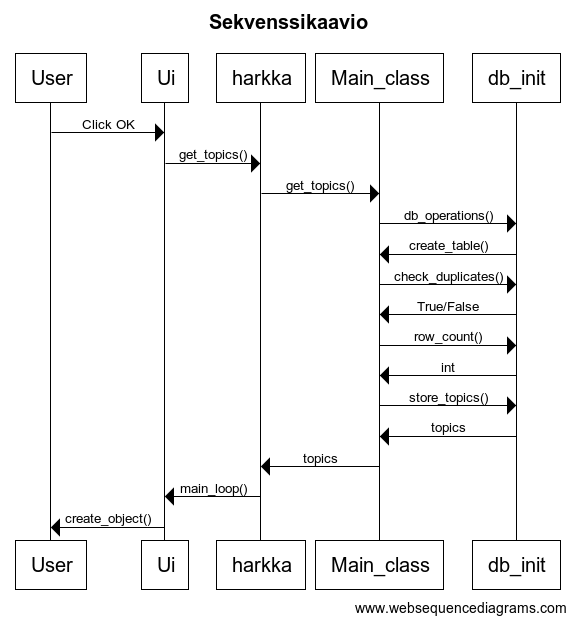

# Arkkitehtuuri

## Käyttöliittymä
Käyttöliittymä sisältää yksinkertaisen näkymän, josta käyttäjä voi ladata kerätyt uutiset näytölle nappia painamalla.

## Luokkakaavio
Ohjelma koostuu kolmesta palasesta. Ylin kerros UI tarjoaa graafisen käyttöliittymän sovellukselle, jossa kerätty data esitetään. Itse datan kerääminen ja käsittely
tapahtuu Services-pakkauksen avulla. Datan käsittely ja tietokantatoiminnot löytyvät Repositories-pakkauksesta.

## Sekvenssikaavio
Yhteys SQL-tietokantaan alustetaan database_connection ohjelmassa, jota db_init hyödyntää tietokantatoiminnoissa. Kaikki tietokantoja alustavat osat löytyvät kansiosta
repositories.

Käyttöliittymän hallinta tapahtuu ui-kansiossa ja sitä ohjaa ohjelma create_ui. Se luo graafisen käyttöliittymän Tkinter-kirjaston avulla ja hoitaa onClick tapahtumia. Ohjelma hakee uutiset tietokannasta kun käyttäjä painaa nappia.

Ohjelman logiikka seijaitsee services-kansiossa. main_service kerää datan internetistä ja hyödyntää repositories-kansion ohjelmia datan tallennuksessa, tarkistuksissa ja hauissa. Lopulta sekä main_service ja create_ui toiminnot yhdistetään ohjelmassa harkka.

